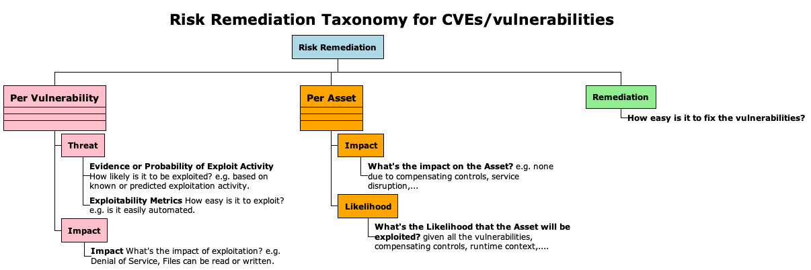
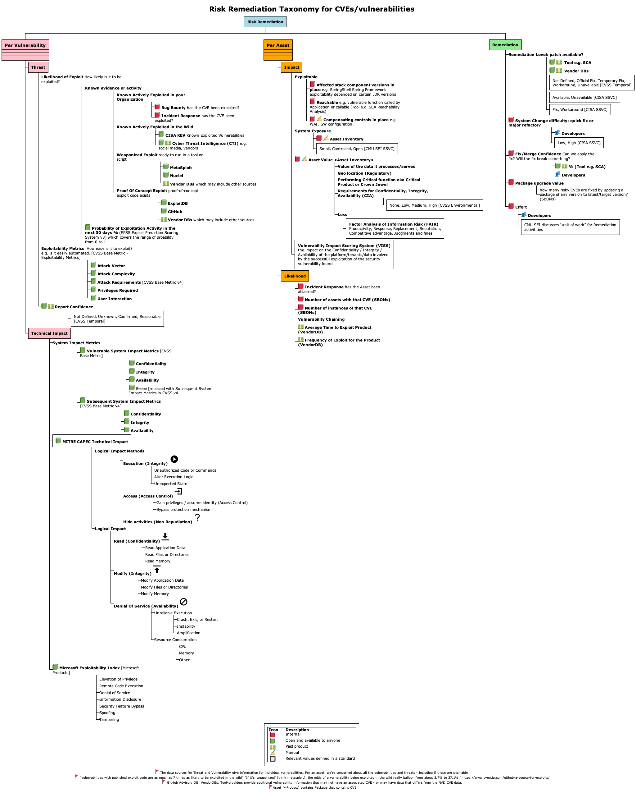
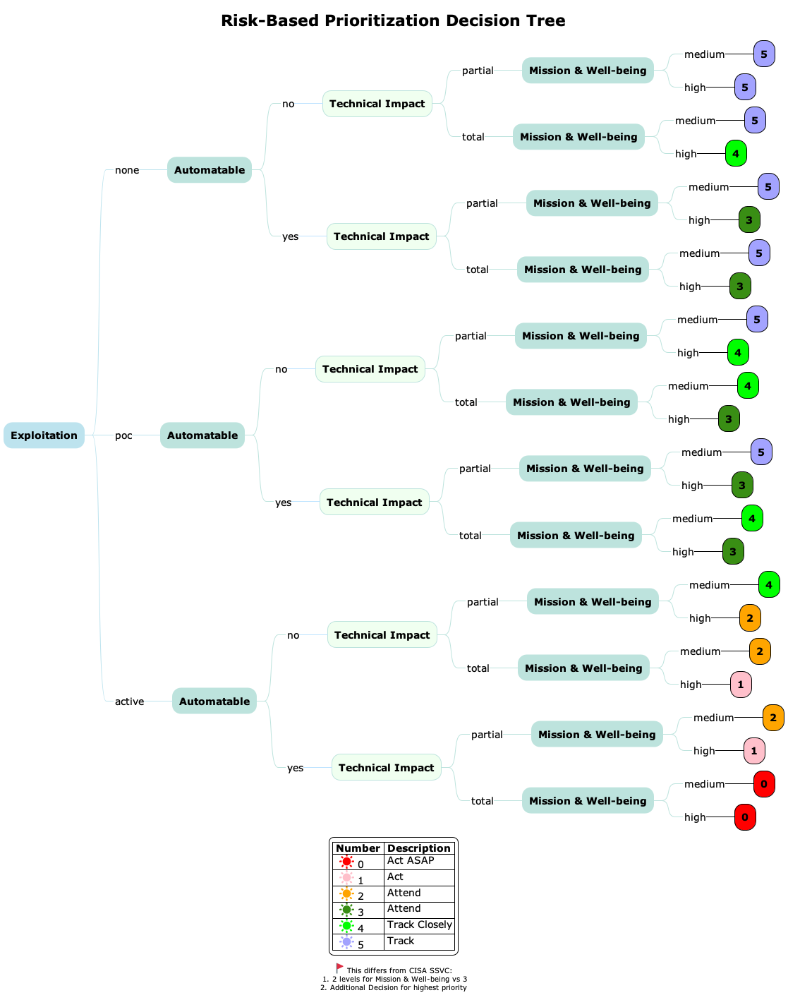

# Risk-Based Prioritization of CVEs

A Risk-Based Prioritization Taxonomy for prioritizing CVEs (Common Vulnerabilities and Exposures).

# Background
A Risk Remediation Taxonomy is defined here to support Risk Based Prioritization of CVEs:
* the constituent components of risk and remediation for a CVE 
* the associated data sources for these components

A Risk-based Decision Tree is defined with
* inputs for the Decision Tree Decision Nodes
* output Decisions

The Risk Remediation Taxonomy and Decision Tree are part of a conference presentation by Yahoo Chris Madden: https://www.bsidesdub.ie/ May 27 2023.

# Risk Remediation
## A tree with the constituent components of Risk and Remediation for a CVE - Top Level



Diagram Source: [RiskRemediation_top.puml](./RiskRemediation_top.puml)


## A tree with the constituent components of Risk and Remediation for a CVE - and associated data sources 


Diagram Source: [RiskRemediation.puml](./RiskRemediation.puml)


# Risk-based Decision Tree Decision Node Inputs
The inputs for the Decision Tree Decision Nodes - and associated data sources from Risk Remediation Taxonomy.


Diagram Source: [RiskRemediation_top.puml](./DT_decisions.puml)


# Risk-based Decision Tree Decisions
The Decision Tree with output Decisions



Diagram Source: [DT_Full.puml](./DT_Full.puml).


# Contribute
Please refer to the [Contributing.md](./Contributing.md) file for information about how to get involved. We welcome issues, questions, and pull requests.


## Plantuml
The diagram(s) are written in the wonderful [Plantuml](https://plantuml.com).
* See https://plantuml.com/running for the many ways to render Plantuml. e.g. 
  ````
  plantuml *.puml -o ./images
  ````

# License
This project is licensed under the terms of the Apache 2.0 open source license. Please refer to [LICENSE](./LICENSE.txt) for the full terms.